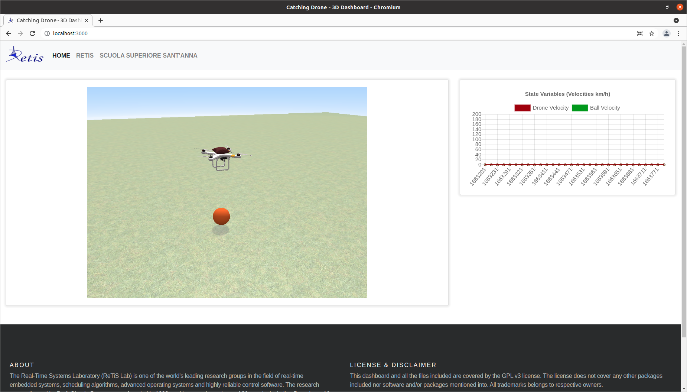
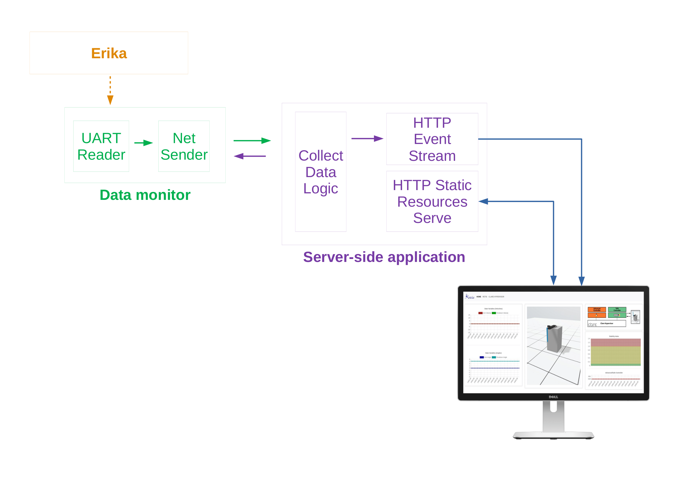

# CatchingDrone - RT simulation of a PD controlled quadcopter

3D real-time simulation of a PD controlled quadcopter



## Overview

The purpose of this demo was to design a real-time software to control a virtual drone that catches a ball thrown by the user. In particular it was required the interaction with a 3D graphic simulation (WebGL based) to display a virtual environment where virtual drone operates. 

Drone modeling and control has to be implemented in C. All tasks are scheduled as real-time tasks taking advantage of [ReTiF](https://github.com/gabriserra/retif). Retif is a framework that enables unprivileged access to the real-time features of Unix-based operating systems in a controlled manner.

### Video

[](http://www.youtube.com/watch?v=c7JfwRTDGME)

### Architecture

This is only a snapshot of the complete report. Plese refer to the [CatchingDrone](docs/CatchingDrone.pdf) PDF document.

The application is subdivided in three main components:
- the control and simulation subsystem
- the server-side application
- the client-side dashboard



The application subsystem is implemented completely in C and works as a physic simulator for a quadcopter. It offers also a user panel to control the simulation. You can find the simulation subsystem source in `simulation` folder.

The server-side application is realized as a Node-JS server application, composed of mainly three components. The collect-data-logic component waits for data coming from the data-monitor subsystem and then store them. When a client connects to the server, the second component HTTP Static Resources Serve serves all the web-application static files to the client that could render the dashboard. Then, when the client is ready, it asks the server to open an event streaming.

We took advantage of server-sent events (SSE) technology. With SSE, a server can send updated data to a web-application at anytime. The client is then notified and have to manage new data coming from the server.

## Getting started

### Data-monitor subsystem

At first you need to install (Allegro)[https://liballeg.org/] that is used to implement the user-panel feature. On Ubuntu, you can install the required version using `apt`.

```
sudo apt update
sudo apt install liballegro4.4 liballegro4-dev
```

Then, compile the C program:

```
cd simulator
make
```

Then you can start the simulation when you want using

```
./sim <ip>
```

providing the IP address of your server-side application (eg. `sim ./127.0.0.1`)

### Server-side application

Move into the root directory and 

```
npm install
```

to load all dependencies. Then 

```
npm run dev
```

to transpile JS and then

```
npm start
```

to run the server.

### Client-side dashboard

Open your browser and go to `http://localhost:3000` if the server-side application runs on the same machine.


